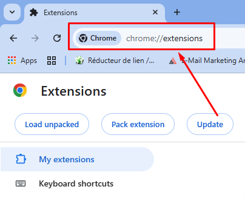
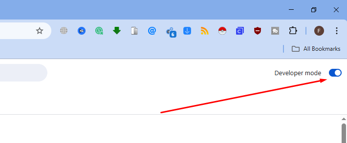
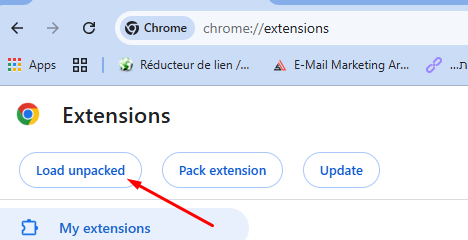
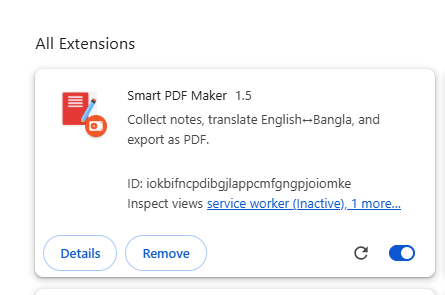

# Smart PDF Maker

**Smart PDF Maker** is a Chrome extension to make taking study notes easier. You can **collect notes from any webpage**, **translate English ↔ Bangla**, and **export your notes as a PDF**.

---

## Features

- Add notes from any webpage using **right-click → Add to Study Notes**.  
- **Toggle translation** between English and Bangla with one click.  
- Undo & redo your changes.  
- Export notes as a PDF.  
- Clear notes when needed — safe until you clear them.

---

## Installation

Follow these simple steps to install **Smart PDF Maker** in Chrome:

1. **Clone this repository** or download it as a ZIP:

git clone https://github.com/yourusername/smart-pdf-maker.git

## Installation

Follow these steps to install **Smart PDF Maker** in Chrome:

1. **Open Google Chrome** and go to `chrome://extensions/`.  
   

2. **Enable Developer mode** (top-right corner).  
   

3. Click **Load unpacked** and select the project folder.  
    

4. The extension is now installed and ready to use!  
   
